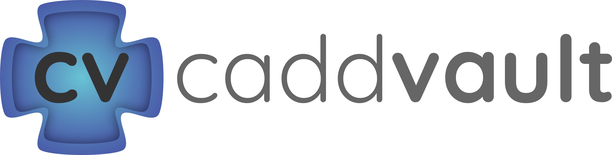

# [Computer-Aided Drug Design (CADD) Vault](https://drugbud-suite.github.io/CADD_Vault/)

Welcome to the [CADD Vault](https://drugbud-suite.github.io/CADD_Vault/), an open-source repository dedicated to sharing resources, tools, and knowledge in the field of computer-aided drug design. This vault aims to support researchers, students, and professionals by providing a comprehensive collection of materials related to CADD.

## About the Vault

The [CADD Vault](https://drugbud-suite.github.io/CADD_Vault/) includes resources on various topics within the domain of computer-aided drug design, including but not limited to:

- Structure- and Ligand-based Virtual Screening
- De Novo Drug Generation
- Protein Structure and Analysis
- Molecular Dynamics Simulations
- Virtual Screening Workflows
- Cheminformatics
- Machine Learning Applications in Drug Design
- Fragment-Based Drug Design (FBDD)
- Datasets for Drug Design
Number of publications: 1086  
Number of code repositories: 933  
Number of webserver links: 140  
Number of webserver links: 123  
  
  
## How to Use the Vault

The vault can be accessed here : [Computer-Aided Drug Design (CADD) Vault](https://drugbud-suite.github.io/CADD_Vault/)

The vault is structured into several sections, each dedicated to a specific aspect of CADD. You can navigate through the repository to explore tutorials, datasets, software tools, and more. We have organized the content into subdirectories for easy navigation.

## Contributing

We welcome contributions from the community! If you have resources, tools, tutorials, or any other content that you believe would benefit others in the field of CADD, please see our **[contributing guidelines](https://github.com/DrugBud-Suite/CADD_Vault/blob/main/CONTRIBUTING.md)** for how to get involved.

## Want your tool or website added?

We provide a **[Google Form](https://forms.gle/pA81nNdRLnkVZEcs7)** to request an entry to be added to the CADD Vault.

Alternatively, Feel free to create an **[issue on Github](https://github.com/DrugBud-Suite/CADD_Vault/issues)** and we would be happy to add your tool or website to the CADD_Vault.

## License

CADD_Vault © 2024 by Antoine Lacour is licensed under CC BY 4.0. To view a copy of this license, visit **[this link](http://creativecommons.org/licenses/by/4.0/)**.

## Acknowledgements

We would like to thank all the contributors who have helped to build this vault, sharing their knowledge and resources with the community.

We particularly thank the creators of the following resources:
    - [awesome-small-molecule-ml](https://github.com/benb111/awesome-small-molecule-ml)
    - [awesome-molecular-docking](https://github.com/Thinklab-SJTU/awesome-molecular-docking?tab=readme-ov-file)
    - [awesome-cheminformatics](https://github.com/hsiaoyi0504/awesome-cheminformatics)
    - [awesome-python-chemistry](https://github.com/lmmentel/awesome-python-chemistry)

## Contact

If you have any questions, suggestions, or would like to contribute, please feel free to contact us via GitHub issues or pull requests.

Thank you for visiting the **[CADD Vault](https://drugbud-suite.github.io/CADD_Vault/)**. Happy exploring!